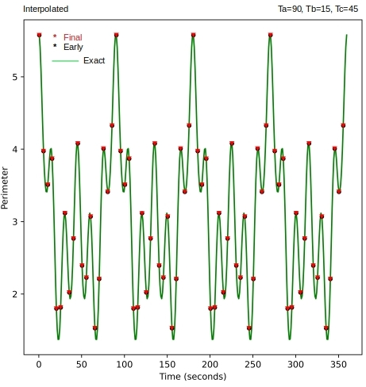

# Computing on Coupled Data Streams with Beam
Coupled data streams need to be analyzed together ensuring simultaneity of events across the participant streams.

This is the source code to go along with the blog article

[Computing on Coupled Data Streams with Beam](http://xplordat.com/2021/09/06/computing-on-coupled-data-streams-with-beam/)

# The Problem

The location data streams from the three vertices are processed to identify a triangle at various time-instants and its perimeter and area computed. As the problem has exact answers we can readily verify whether the stream processing framework correctly reproduces those metrics.

*Figure 1. The vertex points execute a simple harmonic motion around their rest states, along the indicated axis. The monitor at each vertex generates a stream of data for its coordinate position (x,y). These streams are processed together by Beam to compute the perimeter and area of the triangle identified by these three points*

https://user-images.githubusercontent.com/6760508/132264448-9c32332e-e068-42ad-b25b-dbcdc74cf7c7.mp4

*Figure 2. Animation of the deforming triangle. The length of the arrows at any time reflects the speed of movement of the vertex at that time*

*Figure 3. Ta=90, Tb=15, Tc=45. (A) The coordinates of the vertices execute a sinusoidal motion around their rest states (B) The vertices move along the arrowed lines forming deformed triangles (C) The area and perimeter change in chaotic ways but have an overall periodicity as expected*

# The Beam Pipeline

*Figure 4. The events are first grouped by vertex (per time-window) in order to estimate its location at the window mid-point time. The processing is parallel by vertex and by window. They are then re-grouped by the common time instant to assemble the three vertices needed to define a triangle and emit metrics* 

#	Prerequisites

	1. Kafka to produce the data streams
	2. Beam to process the streams
	3. Elasticsearch to store the results for analysis

#	To use this software

	1. Set up a kafka topic 'raw-vertex' & optionally an elasticsearch index to hold the computed metrics for analysis
	2. Edit application.properties, produce.sh and provide Elasticsearch connection details as needed
	3. mvn package
	4. cd scripts
	5. ./run.sh HH:MM (all three data streams will be scheduled to start up at this time)

#	Sample analysis

*Figure 5. The agreement with known analytic solution for the perimeter is excellent.*
